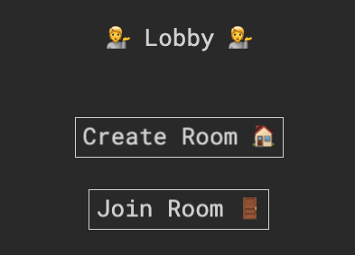
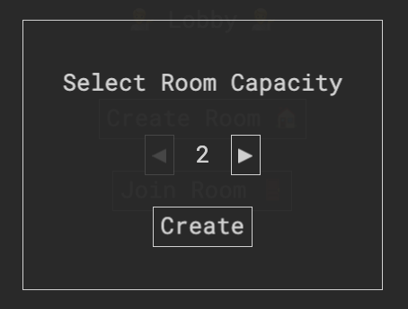
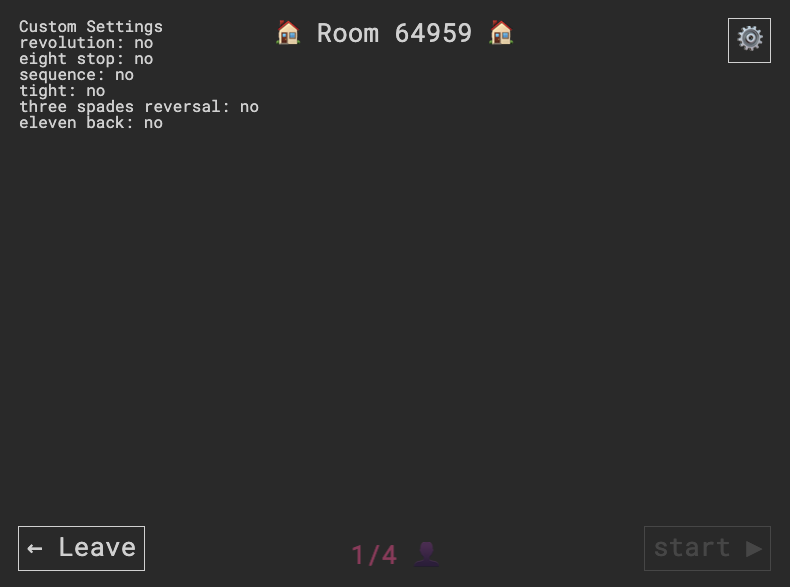
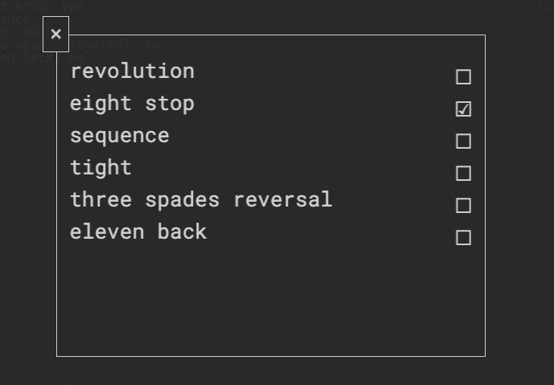
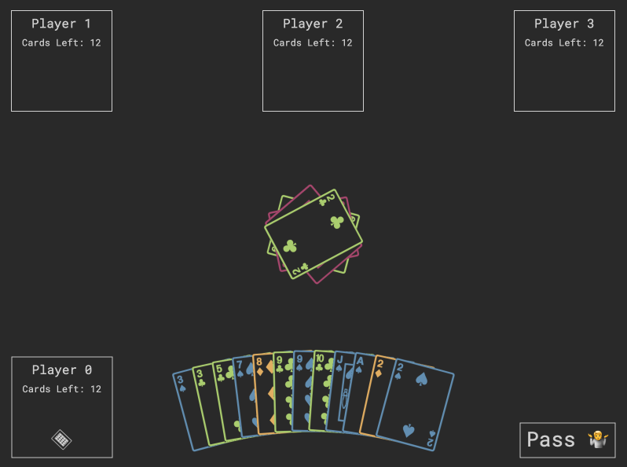

# Tycoon — Real-time multiplyer card game

<p align="center">
  
</p>


## 🃏 How to Play

Click `Create Room`.

<p align="center">
  
</p>

Select number of players for the game.

<p align="center">
  
</p>

Once you create the room, check out the room ID at the top. In the example below, the room ID is `64959`. Tell your friends to `Join Room` with the ID.

<p align="center">
  
</p>

You can click the settings button at the top right and customize the rules. See [Wikipedia](https://en.wikipedia.org/wiki/Daifug%C5%8D) for more details about each option.

<p align="center">
  
</p>

Once the room is full, you can click the `Start` button at the bottom right to start the game.

<p align="center">
  
</p>

Here's the objective of the game:

> Get rid of all the cards one has as fast as possible by playing progressively stronger cards than those of the previous player. (Wikipedia)

Card Rank is:

```
3 < 4 < 5 < ... < 10 < J < Q < K < 1 < 2 < Joker
```

`3` is the weakest and `Joker` is the strongest card.

Enjoy the game!

## 📚 Resources

- [Wikipedia](https://en.wikipedia.org/wiki/Daifug%C5%8D)
- [Card Emojis](https://www.emojibase.com/emojilist/card)
